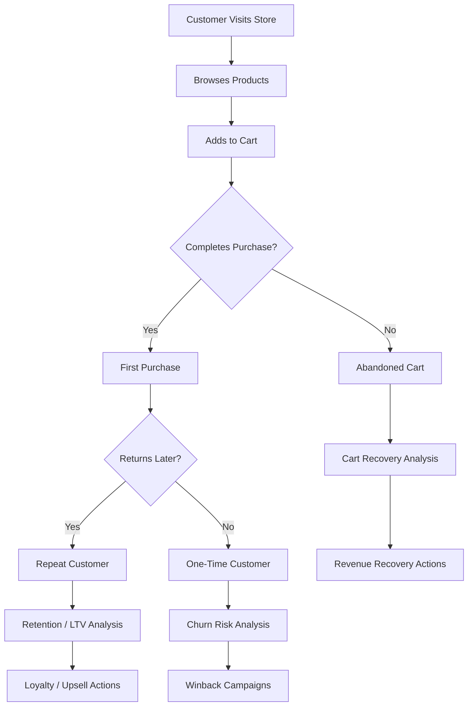
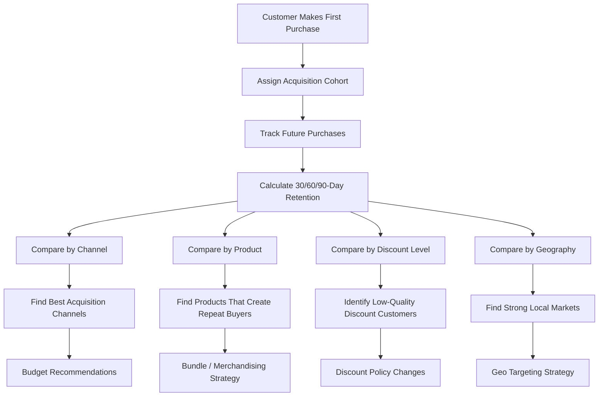
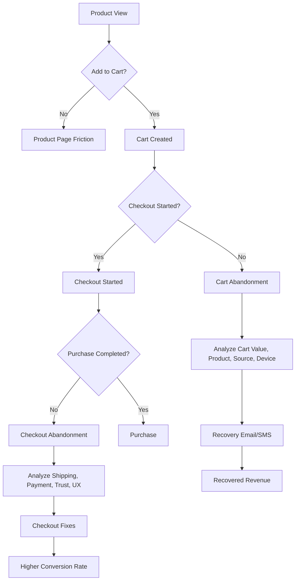
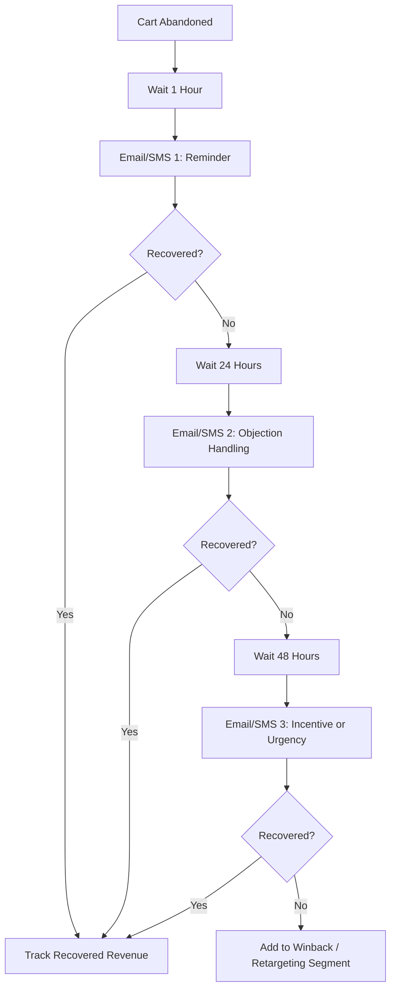
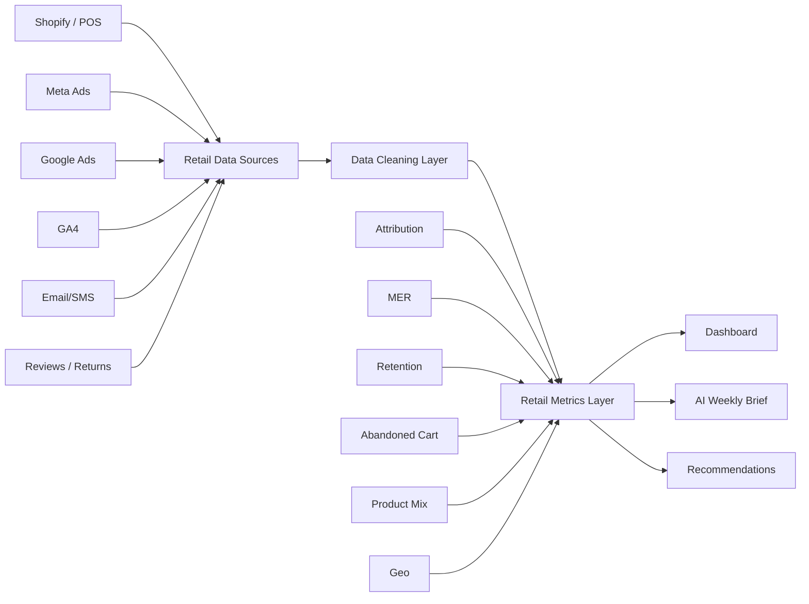
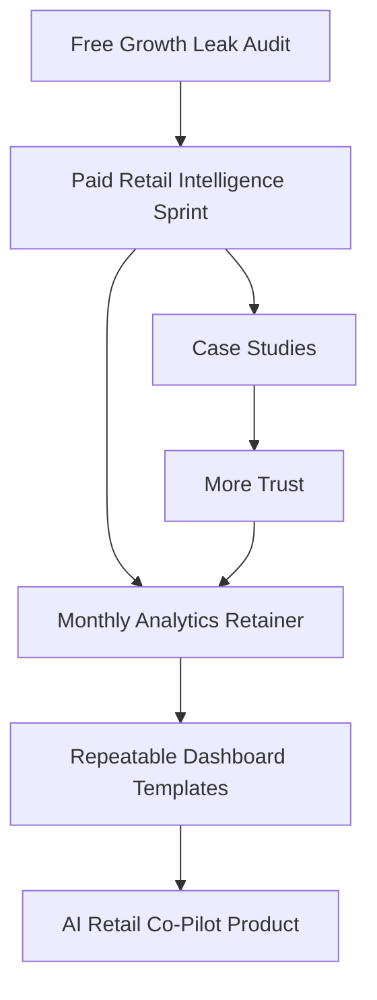
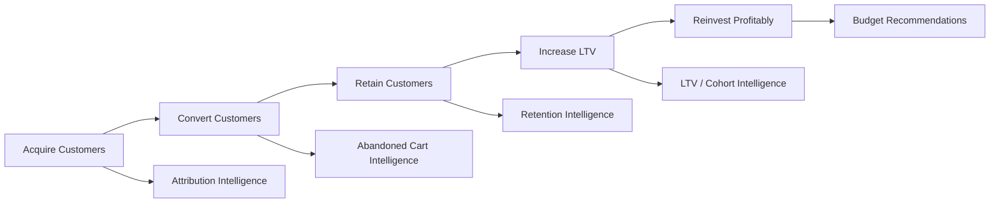

# Retail Analytics / AI Consultancy Plan

## Add-on Focus: Retention + Abandoned Cart Analysis

## Positioning Update

Your consultancy should not only help retailers understand **where revenue came from**, but also where revenue is **quietly leaking**.

The expanded positioning:

> I help retailers understand what drives growth, what prevents repeat purchases, and where customers drop off before buying.

This gives you three strong pillars:

1. **Attribution Intelligence**
   What channels are really driving revenue?

2. **Retention Intelligence**
   Which customers come back, which ones disappear, and why?

3. **Abandoned Cart Intelligence**
   Where are shoppers hesitating, leaking, or failing to convert?

---

# Core Offer

## Retail Growth Leak Audit

A practical analytics audit for ecommerce and retail brands focused on finding hidden revenue leaks across acquisition, conversion, retention, and post-purchase behavior.

## Main Questions Answered

| Area              | Business Question                                       |
| ----------------- | ------------------------------------------------------- |
| Attribution       | Are ad platforms overclaiming revenue?                  |
| MER               | Is total marketing spend actually efficient?            |
| Retention         | Are we acquiring customers who come back?               |
| Cohorts           | Which customer groups have the best long-term value?    |
| Abandoned Cart    | Where are customers dropping before purchase?           |
| Product Mix       | Which products create repeat buyers vs one-time buyers? |
| Reviews / Returns | Which products damage trust or margin?                  |
| Geo               | Where do we have demand, friction, or opportunity?      |

---

# Expanded Analytics Framework



---

# Pillar 1: Attribution Intelligence

## Goal

Help retailers understand what marketing channels are truly contributing to revenue.

## Key Metrics

| Metric              | Meaning                                                 |
| ------------------- | ------------------------------------------------------- |
| Platform ROAS       | Revenue claimed by each ad platform                     |
| Blended MER         | Total Revenue ÷ Total Marketing Spend                   |
| CAC                 | Cost to acquire a customer                              |
| New Customer CAC    | Cost to acquire a first-time buyer                      |
| Paid Revenue Share  | Percent of revenue influenced by paid media             |
| Attribution Overlap | Revenue claimed by more than one platform               |
| GA4 / Shopify Gap   | Difference between analytics-reported and actual orders |

## Output

A clear view of whether the business is actually growing profitably, or whether platforms are taking too much credit.

---

# Pillar 2: Retention Intelligence

## Goal

Help retailers understand whether they are acquiring valuable customers or just generating one-time sales.

## Core Retention Questions

| Question                                        | Why It Matters                              |
| ----------------------------------------------- | ------------------------------------------- |
| Do customers come back after first purchase?    | Shows quality of acquisition                |
| Which channels bring repeat buyers?             | Helps reallocate budget                     |
| Which first products lead to higher LTV?        | Improves merchandising and bundles          |
| Which cohorts decay fastest?                    | Reveals weak campaigns or poor customer fit |
| How long does it take customers to reorder?     | Helps time email/SMS campaigns              |
| Are discounts attracting low-quality customers? | Prevents margin-destroying growth           |

---

## Retention Metrics

| Metric                  | Definition                                               |
| ----------------------- | -------------------------------------------------------- |
| Repeat Purchase Rate    | % of customers who buy more than once                    |
| 30/60/90-Day Retention  | % of customers who return within each window             |
| Customer LTV            | Total revenue or gross margin per customer               |
| Time to Second Purchase | Days between first and second order                      |
| Cohort Revenue          | Revenue generated by customers acquired in a given month |
| Churn Risk              | Customers unlikely to return                             |
| Product-Led Retention   | Retention by first product purchased                     |
| Channel-Led Retention   | Retention by acquisition source                          |

---

## Retention Analysis Flow



---

# Retention Deliverables

## 1. Cohort Retention Heatmap

Shows what percentage of customers from each acquisition month returned after 30, 60, 90, or 180 days.

Example insight:

> March customers had high first-order volume but 3x lower 90-day retention than other cohorts, suggesting the campaign brought low-quality traffic.

---

## 2. LTV Curve

Shows cumulative revenue or gross margin by customer cohort over time.

Useful for answering:

> Are customers becoming more valuable after acquisition, or does revenue stop after the first order?

---

## 3. Channel Quality Scorecard

| Channel       |    CAC | First Orders | 90-Day Retention |    LTV | Quality |
| ------------- | -----: | -----------: | ---------------: | -----: | ------- |
| Meta          |   High |         High |              Low | Medium | Risky   |
| Google Search | Medium |       Medium |             High |   High | Strong  |
| Email         |    Low |       Medium |             High |   High | Strong  |
| Influencer    |   High |         High |              Low |    Low | Weak    |

---

## 4. Product Retention Matrix

| First Product Purchased | Repeat Purchase Rate | Avg LTV | Recommendation                   |
| ----------------------- | -------------------: | ------: | -------------------------------- |
| Starter Bundle          |                 High |    High | Promote as acquisition product   |
| Single Low-Price Item   |                  Low |     Low | Avoid using as main paid ad hook |
| Premium Product         |               Medium |    High | Use with financing or bundles    |
| Seasonal Item           |                  Low |  Medium | Add post-purchase winback flow   |

---

# Pillar 3: Abandoned Cart Intelligence

## Goal

Help retailers recover lost revenue by identifying where customers abandon the buying journey.

## Core Abandoned Cart Questions

| Question                                        | Why It Matters                              |
| ----------------------------------------------- | ------------------------------------------- |
| How many shoppers add to cart but do not buy?   | Measures conversion leakage                 |
| Which products are most abandoned?              | Reveals price, trust, or shipping friction  |
| Which traffic sources create abandoned carts?   | Identifies low-intent traffic               |
| At what cart value do people abandon?           | Helps set free shipping or promo thresholds |
| Do discounts reduce abandonment?                | Tests offer sensitivity                     |
| Are mobile users abandoning more?               | Reveals UX or checkout friction             |
| Are returning customers abandoning differently? | Separates trust issues from price issues    |

---

## Abandoned Cart Metrics

| Metric                    | Definition                            |
| ------------------------- | ------------------------------------- |
| Add-to-Cart Rate          | Product viewers who add to cart       |
| Cart Abandonment Rate     | Carts created but not purchased       |
| Checkout Abandonment Rate | Checkouts started but not completed   |
| Recovery Rate             | Abandoned carts later converted       |
| Recovered Revenue         | Revenue from cart recovery            |
| Time to Recovery          | Time between abandonment and purchase |
| Abandoned Cart Value      | Dollar value of carts not purchased   |
| Product Abandonment Rate  | Abandonment by SKU/category           |
| Channel Abandonment Rate  | Abandonment by traffic source         |

---

## Abandoned Cart Analysis Flow



---

# Abandoned Cart Diagnostic

## Segment the Problem

| Segment        | What to Look For                                           |
| -------------- | ---------------------------------------------------------- |
| Product        | Are certain SKUs abandoned more often?                     |
| Category       | Are high-consideration categories leaking?                 |
| Price Band     | Do carts above/below certain values abandon more?          |
| Discount Usage | Do shoppers wait for a coupon?                             |
| Device         | Is mobile checkout underperforming?                        |
| Geography      | Are shipping costs or delivery times hurting conversion?   |
| Channel        | Are paid social shoppers less likely to complete checkout? |
| Customer Type  | Do new customers abandon more than returning customers?    |

---

## Common Findings

| Pattern                                | Possible Meaning          | Action                           |
| -------------------------------------- | ------------------------- | -------------------------------- |
| High add-to-cart, low purchase         | Price/shipping shock      | Test free shipping threshold     |
| High checkout start, low completion    | Checkout/payment friction | Audit checkout UX                |
| Paid social has high cart abandonment  | Low-intent traffic        | Refine targeting/creative        |
| Mobile abandonment much higher         | Mobile UX issue           | Simplify checkout                |
| High abandonment on one product        | Product trust issue       | Add reviews, images, FAQs        |
| Returning customers abandon less       | Trust gap for new buyers  | Add guarantees/social proof      |
| Abandoned carts recover with discounts | Price sensitivity         | Test controlled incentive ladder |

---

# Abandoned Cart Recovery System



---

# AI Use Cases

## AI Brief for Retention

Example output:

> Retention softened this week among customers acquired through Meta campaigns. The March cohort continues to underperform, with 90-day repeat purchase rates significantly below average. Customers whose first order included bundles are showing stronger repeat behavior, suggesting bundles should be used more aggressively in acquisition campaigns.

---

## AI Brief for Abandoned Cart

Example output:

> Cart abandonment increased this week, especially on mobile and among new customers. The highest leakage is concentrated in carts between $75 and $110, suggesting shipping cost or free-shipping threshold friction. Paid social traffic is generating high add-to-cart volume but weaker checkout completion, indicating lower purchase intent or landing page mismatch.

---

# Updated Offer Ladder

## Free Offer

### Retail Growth Leak Snapshot

A lightweight diagnostic covering:

* Attribution mismatch
* MER trend
* Retention red flags
* Abandoned cart leakage
* Product/category concerns
* One recommended next move

---

## Paid Starter Offer

### Retail Intelligence Sprint

Price: **$1,500–$3,500**

Includes:

* Revenue and order analysis
* Channel attribution sanity check
* MER dashboard
* Cohort retention analysis
* Abandoned cart analysis
* Product/category performance
* Review/return friction
* Executive readout
* Recommended action plan

---

## Monthly Retainer

### Fractional Retail Analytics Lead

Price: **$2,500–$7,500/month**

Includes:

* Weekly performance brief
* Retention monitoring
* Abandoned cart monitoring
* Channel quality scorecard
* Product/category diagnostics
* Campaign and cohort analysis
* Monthly strategy call
* AI-generated executive summary

---

# Example Weekly Retail Intelligence Brief

## Executive Summary

Revenue increased, but the quality of growth weakened. Paid social drove more traffic and carts, but those customers had lower checkout completion and weaker early retention. Email and returning customers remained the strongest efficiency drivers.

## Key Findings

| Area           | Finding                                  | Action                              |
| -------------- | ---------------------------------------- | ----------------------------------- |
| Revenue        | Orders increased 12% WoW                 | Monitor whether lift is profitable  |
| Attribution    | Meta ROAS looks strong, but MER is flat  | Avoid increasing budget yet         |
| Retention      | New Meta cohort has weak repeat behavior | Review campaign targeting           |
| Abandoned Cart | Mobile cart abandonment rose 18%         | Audit mobile checkout               |
| Product        | Starter bundle has highest repeat rate   | Use bundle in acquisition campaigns |
| Returns        | One category has elevated refund rate    | Review product page expectations    |

## Recommended Actions

1. Do not scale Meta until cohort quality improves.
2. Test bundle-led acquisition creative.
3. Add free-shipping threshold test for carts above $75.
4. Improve mobile checkout speed and payment options.
5. Create a winback flow for one-time buyers after 45 days.

---

# Client Dashboard Structure



---

# Revised Consultancy Narrative

## What You Help Clients See

Most retailers know how much they sold.

Fewer know:

* Which customers are worth acquiring
* Which channels create repeat buyers
* Which products create loyalty
* Where carts are being abandoned
* Whether ads are creating profit or just noisy revenue
* Whether growth is healthy or fragile

Your consultancy helps them move from:

> “Sales went up.”

To:

> “Sales went up, but retention worsened, abandoned carts rose on mobile, and Meta is bringing lower-quality customers. We should fix checkout and shift acquisition toward bundle-led campaigns before scaling spend.”

That is the value.

---

# Stronger One-Liner

> I help ecommerce and retail brands find hidden growth leaks across attribution, retention, abandoned carts, product performance, and customer behavior.

---

# Better Website Hero

## Retail analytics for brands that want better growth, not just more dashboards.

Your ads, store, analytics tools, and customer data all tell different stories. I help you connect them into one clear view of what is driving revenue, where customers are dropping off, and what to fix next.

**Free offer:** Retail Growth Leak Snapshot
**Paid offer:** Retail Intelligence Sprint
**Ongoing offer:** Fractional Retail Analytics Lead

---

# Better Outreach Message

```text
Hey [Name] — I’m building a retail analytics practice focused on helping ecommerce brands find hidden growth leaks across attribution, retention, and abandoned carts.

A lot of brands see decent ad ROAS but still struggle with repeat purchases, cart abandonment, or unclear channel performance.

I built a demo showing how this looks in practice: platform overclaiming, weak cohorts, abandoned revenue, and weekly AI-generated recommendations.

Would it be useful if I did a free mini “growth leak” readout for [Brand]?
No pitch deck — just 3–5 observations on where I’d look first.
```

---

# Final Business Shape



---

# Recommended First Productized Sprint

## Retail Intelligence Sprint

### Duration

10 business days

### Price

Start at **$2,500**

### Inputs

* Shopify/POS export
* Meta Ads export
* Google Ads export
* GA4 export
* Email/SMS export
* Product catalog
* Order/customer history
* Returns/refunds
* Reviews, if available

### Outputs

* Executive dashboard
* Attribution sanity check
* MER analysis
* Cohort retention heatmap
* LTV curves
* Abandoned cart analysis
* Product/category scorecard
* Customer quality findings
* 5–10 recommended actions
* Optional AI-generated weekly brief

---

# The Big Strategic Point

Retention and abandoned cart analysis make the consultancy much stronger.

Attribution tells the client:

> “Where did the customer come from?”

Retention tells them:

> “Was that customer worth acquiring?”

Abandoned cart tells them:

> “Why didn’t more customers buy?”

Together, they form a complete growth system:



This is the consultancy:

> **Help retailers acquire better customers, convert more of them, and keep them longer.**
